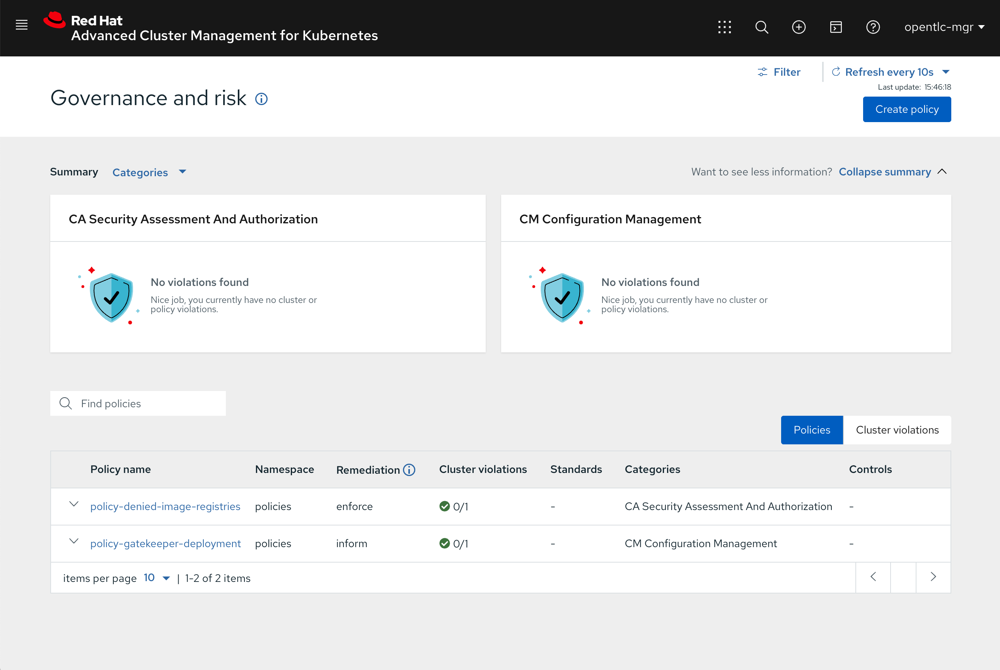
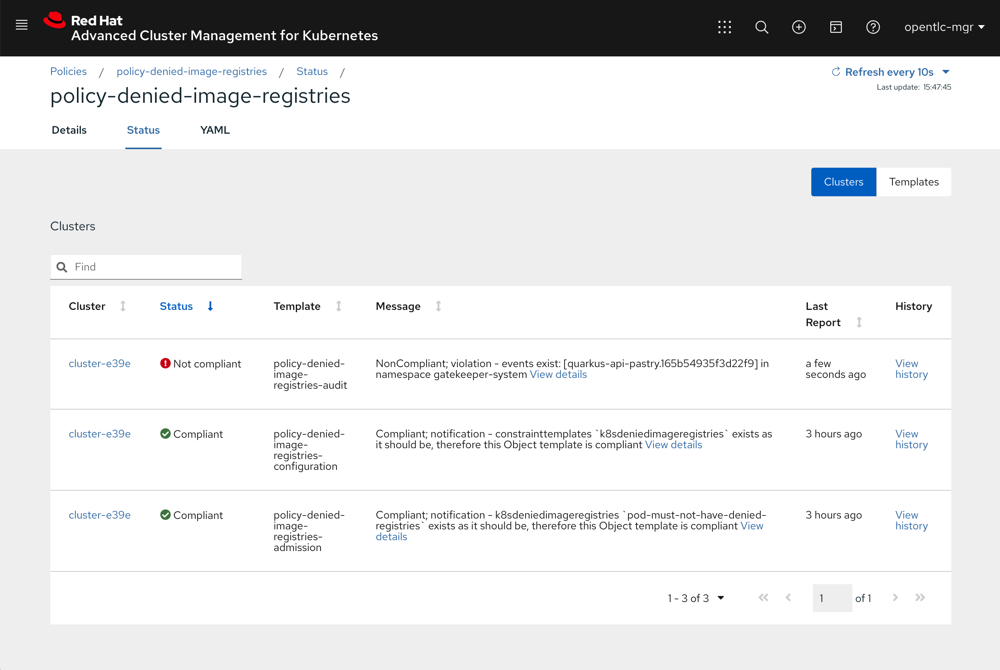

# Open Policy Agent and GateKeeper explorations

This is a repository for exploration on [Open Policy Agent](https://www.openpolicyagent.org) and specifically the [Kubernetes part](https://www.openpolicyagent.org/docs/latest/kubernetes-introduction/) using Gatekeeper. On OpenShift only for the moment :wink: but will amend with Kubernetes stuffs if necessary.

## Deploying GateKeeper

GateKeeper is the Kubernetes admission controller that is enforcing policies when user creates, updates, deletes resources in the Kubernetes cluster.

### Installation from README

```sh
oc new-project gatekeeper-system
oc apply -f https://raw.githubusercontent.com/open-policy-agent/gatekeeper/release-3.2/deploy/gatekeeper.yaml -n gatekeeper-system
```

> gatekeeper-system/gatekeeper-audit does not scale...

```
Error creating: pods "gatekeeper-audit-77bd6fc7d8-" is forbidden: unable to validate against any security context constraint: [pod.metadata.annotations.container.seccomp.security.alpha.kubernetes.io/manager: Forbidden: seccomp may not be set spec.containers[0].securityContext.runAsUser: Invalid value: 1000: must be in the ranges: [1000610000, 1000619999] pod.metadata.annotations.container.seccomp.security.alpha.kubernetes.io/manager: Forbidden: seccomp may not be set]
```

> gatekeeper-system/gatekeeper-controller-manager does not scale...

```
Error creating: pods "gatekeeper-controller-manager-6c7665cbd7-" is forbidden: unable to validate against any security context constraint: [pod.metadata.annotations.container.seccomp.security.alpha.kubernetes.io/manager: Forbidden: seccomp may not be set spec.containers[0].securityContext.runAsUser: Invalid value: 1000: must be in the ranges: [1000610000, 1000619999] pod.metadata.annotations.container.seccomp.security.alpha.kubernetes.io/manager: Forbidden: seccomp may not be set]
```

> It's because of the the seccomp annotation we have on both deployments.

```yaml
annotations:
  container.seccomp.security.alpha.kubernetes.io/manager: runtime/default
```

### Fix that for OpenShift

```sh
oc adm policy add-scc-to-user anyuid system:serviceaccount:gatekeeper-system:gatekeeper-admin
oc patch deployment/gatekeeper-audit --type json -p='[{"op": "remove", "path": "/spec/template/metadata/annotations"}]' -n gatekeeper-system
oc patch deployment/gatekeeper-controller-manager --type json -p='[{"op": "remove", "path": "/spec/template/metadata/annotations"}]' -n gatekeeper-system
```

### Review and adapt webhook configuration

```sh
oc get ValidatingWebhookConfiguration/gatekeeper-validating-webhook-configuration -o json | jq .webhooks  
[
  {
    "admissionReviewVersions": [
      "v1beta1"
    ],
    "clientConfig": {
      "caBundle": "LS0...==",
      "service": {
        "name": "gatekeeper-webhook-service",
        "namespace": "gatekeeper-system",
        "path": "/v1/admit",
        "port": 443
      }
    },
    "failurePolicy": "Ignore",
    "matchPolicy": "Exact",
    "name": "validation.gatekeeper.sh",
    "namespaceSelector": {
      "matchExpressions": [
        {
          "key": "admission.gatekeeper.sh/ignore",
          "operator": "DoesNotExist"
        }
      ]
    },
    "objectSelector": {},
    "rules": [
      {
        "apiGroups": [
          "*"
        ],
        "apiVersions": [
          "*"
        ],
        "operations": [
          "CREATE",
          "UPDATE"
        ],
        "resources": [
          "*"
        ],
        "scope": "*"
      }
    ],
    "sideEffects": "None",
    "timeoutSeconds": 3
  },
  {
    "admissionReviewVersions": [
      "v1beta1"
    ],
    "clientConfig": {
      "caBundle": "LS0...==",
      "service": {
        "name": "gatekeeper-webhook-service",
        "namespace": "gatekeeper-system",
        "path": "/v1/admitlabel",
        "port": 443
      }
    },
    "failurePolicy": "Fail",
    "matchPolicy": "Exact",
    "name": "check-ignore-label.gatekeeper.sh",
    "namespaceSelector": {},
    "objectSelector": {},
    "rules": [
      {
        "apiGroups": [
          ""
        ],
        "apiVersions": [
          "*"
        ],
        "operations": [
          "CREATE",
          "UPDATE"
        ],
        "resources": [
          "namespaces"
        ],
        "scope": "*"
      }
    ],
    "sideEffects": "None",
    "timeoutSeconds": 3
  }
]
```

Put a namespace selector to activate web hook for namespaces annotated with `lbroudoux.github.com/gatekeeper-active: true`:

```
oc patch ValidatingWebhookConfiguration/gatekeeper-validating-webhook-configuration -p='{"webhooks":[{"name":"validation.gatekeeper.sh","namespaceSelector":{"matchExpressions":[{"key":"lbroudoux.github.com/gatekeeper-active","operator":"In","values":["true"]}]}}]}'
```

## Defining Constraint

First create a `ConstraintTemplate`

```yaml
apiVersion: templates.gatekeeper.sh/v1beta1
kind: ConstraintTemplate
metadata:
  name: k8sdeniedimageregistries
spec:
  crd:
    spec:
      names:
        kind: K8sDeniedImageRegistries
  targets:
    - target: admission.k8s.gatekeeper.sh
      rego: |
        package denied_image_registries

        default is_gatekeeper = false

        # Checks whether the policy 'input' has came from Gatekeeper
        is_gatekeeper {
          has_field(input, "review")
          has_field(input.review, "object")
        }

        # Check the obj contains a field
        has_field(obj, field) {
          obj[field]
        }

        # Get the input, as the input is not Gatekeeper based
        object = input {
          not is_gatekeeper
        }

        # Get the input.review.object, as the input is Gatekeeper based
        object = input.review.object {
          is_gatekeeper
        }

        # Set the .kind of the object we are currently working on
        kind = object.kind

        violation[{"msg": msg}] {
          lower(kind) == "pod"
          some i
          image := object.spec.containers[i].image
          not startswith(image, "quay.io/")
          msg := sprintf("image '%v' comes from untrusted registry", [image])
          # msg := sprintf("REVIEW OBJECT: %v", [input.review])
        }
```

And apply it:

```sh
oc create -f templates/k8sdeniedimageregistries.yaml -n gatekeeper-system 
```

Then define a `Constraint`  of the CR type that was defined into previous `ConstraintTemplate`:

```yaml
apiVersion: constraints.gatekeeper.sh/v1beta1
kind: K8sDeniedImageRegistries
metadata:
  name: pod-must-not-have-denied-registries
spec:
  match:
    kinds:
      - apiGroups: [""]
        kinds: ["Pod"]
```

And apply it:

```sh
oc create -f constraints/k8sdeniedimageregistries.yaml -n gatekeeper-system
```

Then you can test creating a new namespace and creating violating resource:

```sh
$ oc new-project opa-test
$ oc label namespace/opa-test lbroudoux.github.com/gatekeeper-active=true
$ oc create -f tests/denied-pod.yaml -n opa-test
Error from server ([denied by pod-must-not-have-denied-registries] image 'docker.io/microcks/quarkus-api-pastry:latest' comes from untrusted registry): error when creating "tests/denied-pod.yaml": admission webhook "validation.gatekeeper.sh" denied the request: [denied by pod-must-not-have-denied-registries] image 'docker.io/microcks/quarkus-api-pastry:latest' comes from untrusted registry
```

## Using Confttest

Contest is a CLI tool allowing to test and validate your REGO policy definitions. Some policies are created within `policy/`  folder. 

```sh
brew tap instrumenta/instrumenta 
brew install conftest
```

REGO files can be written for accepting both plain YAML files and Gatekeeper `Review` resources. Check some plumbing functions that allows that into REGO file: 

```
default is_gatekeeper = false

# Checks whether the policy 'input' has came from Gatekeeper
is_gatekeeper {
   has_field(input, "review")
   has_field(input.review, "object")
}
# Check the obj contains a field
has_field(obj, field) {
   obj[field]
}
# Get the input, as the input is not Gatekeeper based
object = input {
   not is_gatekeeper
}
# Get the input.review.object, as the input is Gatekeeper based
object = input.review.object {
   is_gatekeeper
}
```

You can check the `test-policies.sh` file to see how to use `conftest`.

## Deploying Konstraint

`konstraint` is a CLI tool that allow the generation of `ConstraintTemplate` and `Constraint` resources (as well as documentation) from REGO files. Just download `konstraint` from [Release v0.10.0 · plexsystems/konstraint · GitHub](https://github.com/plexsystems/konstraint/releases/tag/v0.10.0), place it into your `PATH` and don’t forget to `chmod a+x konstraint`

Check how `konstraint` creates templates, constraints and documentation:

```sh
konstraint create
konstraint doc
```

## Managing OPA policies from Open Cluster Management (aka RHACM)

[Open Cluster Management](https://open-cluster-management.io/) is the upstream community project bringing Multi-cluster Management features for Kubernetes and specially for OpenShift in a flavour called [Red Hat Advanced Cluster Management](https://access.redhat.com/documentation/en-us/red_hat_advanced_cluster_management_for_kubernetes/2.1/).

We can use RHCAM to ensure and enforce that our OPA Policies and GateKeeper Constraints are deployed on the many cluster we have to manage.

First, start installing at least 2 clusters. One will be the Hub (as referenced into the [RHACM isntallation documentation](https://access.redhat.com/documentation/en-us/red_hat_advanced_cluster_management_for_kubernetes/2.1/html-single/install/index)) ; the other will be the managed one. Then, set up Open Cluster Management or RHACM as per the [doc](https://access.redhat.com/documentation/en-us/red_hat_advanced_cluster_management_for_kubernetes/2.1/html-single/install/index).

OCM uses `Policy` alongside with `PlacementRule` to define to which clusters it should be applied and `PlacementBinding` to apply a placement rule to a policy. We'll simply wrap our GateKeeper `ConstraintTemplate` and `Constraints` with an OCM `Policy` like below:

```yaml
apiVersion: policy.open-cluster-management.io/v1
kind: Policy
metadata:
  name: policy-denied-image-registries
  annotations:
    policy.open-cluster-management.io/categories: 'CA Security Assessment and Authorization'
spec:
  policy-templates:
    - objectDefinition: 
        apiVersion: policy.open-cluster-management.io/v1
        kind: ConfigurationPolicy
        metadata:
          name: policy-denied-image-registries-configuration
        spec:
          severity: high
          namespaceSelector:
            include: ["gatekeeper-system"]
          object-templates:
            - complianceType: musthave
              objectDefinition:
                apiVersion: templates.gatekeeper.sh/v1beta1
                kind: ConstraintTemplate
                metadata:
                  name: k8sdeniedimageregistries
                spec:
                  crd:
                    spec:
                      names:
                        kind: K8sDeniedImageRegistries
                  targets:
                    - target: admission.k8s.gatekeeper.sh
                      rego: |-
                        package denied_image_registries

                        default is_gatekeeper = false

                        # Checks whether the policy 'input' has came from Gatekeeper
                        is_gatekeeper {
                          has_field(input, "review")
                          has_field(input.review, "object")
                        }

                        # Check the obj contains a field
                        has_field(obj, field) {
                          obj[field]
                        }

                        # Get the input, as the input is not Gatekeeper based
                        object = input {
                          not is_gatekeeper
                        }

                        # Get the input.review.object, as the input is Gatekeeper based
                        object = input.review.object {
                          is_gatekeeper
                        }

                        # Set the .kind of the object we are currently working on
                        kind = object.kind

                        violation[{"msg": msg}] {
                          lower(kind) == "pod"
                          some i
                          image := object.spec.containers[i].image
                          not startswith(image, "quay.io/")
                          msg := sprintf("image '%v' comes from untrusted registry", [image])
                          # msg := sprintf("REVIEW OBJECT: %v", [input.review])
                        }
          remediationAction: inform
    - objectDefinition:
        apiVersion: policy.open-cluster-management.io/v1
        kind: ConfigurationPolicy
        metadata:
          name: policy-denied-image-registries-audit
        spec:
          severity: medium
          namespaceSelector:
            include: ["gatekeeper-system"]
          object-templates:
            - complianceType: musthave
              objectDefinition:
                apiVersion: constraints.gatekeeper.sh/v1beta1
                kind: K8sDeniedImageRegistries
                metadata:
                  name: pod-must-not-have-denied-registries
                spec:
                  match:
                    kinds:
                      - apiGroups: [""]
                        kinds: ["Pod"]
                status:
                  totalViolations: 0
    - objectDefinition:
        apiVersion: policy.open-cluster-management.io/v1
        kind: ConfigurationPolicy
        metadata:
          name: policy-denied-image-registries-admission
        spec:
          severity: low
          object-templates:
            - complianceType: mustnothave
              objectDefinition:
                apiVersion: v1
                kind: Event
                metadata:
                  namespace: gatekeeper-system
                  annotations:
                    constraint_action: deny
                    constraint_kind: K8sDeniedImageRegistries
                    constraint_name: pod-must-not-have-denied-registries
                    event_type: violation
  remediationAction: inform
  disabled: false
---
apiVersion: policy.open-cluster-management.io/v1
kind: PlacementBinding
metadata:
  name: binding-policy-denied-image-registries
placementRef:
  name: placement-policy-denied-image-registries
  kind: PlacementRule
  apiGroup: apps.open-cluster-management.io
subjects:
- name: policy-denied-image-registries
  kind: Policy
  apiGroup: policy.open-cluster-management.io
---
apiVersion: apps.open-cluster-management.io/v1
kind: PlacementRule
metadata:
  name: placement-policy-denied-image-registries
spec:
  clusterConditions:
  - status: "True"
    type: ManagedClusterConditionAvailable
  clusterSelector:
    matchExpressions:
      - {key: environment, operator: In, values: ["dev"]}
```

Some explanations below:
* The `Policy` is holding a first `ConfigurationPolicy` telling that managed cluster should have the `k8sdeniedimageregistries` `ConstraintTemplate` deployed,
* Then it contains the `Constraint` definition as well as a check of the `status.totalViolations` field to raise alerts in case of there is existing violations,
* Finally it contains a `ConfigurationPolicy` that is checking for violation events. This allow OCM to raise violation alerts when GateKeeper raise a `deny` event when someone tries creating a new rviolating esource on managed cluster.

In order to get this one working well, you'll need to turn on deny logs and events on GateKeeper on the managed server.

```sh
oc patch deployment/gatekeeper-controller-manager --type json -p='[{"op": "add", "path": "/spec/template/spec/containers/0/args/-", "value": "--log-denies"}, {"op": "add", "path": "/spec/template/spec/containers/0/args/-", "value": "--emit-admission-events"}]' -n gatekeeper-system
```

Want to play with it? First login to the Hub server and create policies:

```sh
oc create project policies
oc create ocm/policy-denied-image-registries.yaml -n policies
oc create ocm/policy-gatekeeper-deployment.yaml -n policies
```

> `policy-gatekeeper-deployment.yaml` is another policy that validates that GateKeeper has been deployed on managed cluster.

At first, the `policy-denied-image-registries` will not be synced to the managed cluster so you'll need to `Enforce` it through the controls. Thus, GateKeeper constraints will be created on the managed cluster side.



Now, login to the managed cluster and after having created a `opa-test` has described above, try creating a conflicting resource:

```sh
$ oc create -f tests/denied-pod.yaml -n opa-test                             
Error from server ([denied by pod-must-not-have-denied-registries] image 'docker.io/microcks/quarkus-api-pastry:latest' comes from untrusted registry): error when creating "tests/denied-pod.yaml": admission webhook "validation.gatekeeper.sh" denied the request: [denied by pod-must-not-have-denied-registries] image 'docker.io/microcks/quarkus-api-pastry:latest' comes from untrusted registry
```

Drill down to the violation details in RHACM and you'll get the reference of the `Event` that raise the violation alert:



## Useful resources

* OPA `kube-mgmt` to Gatekeeper evolution: https://www.infracloud.io/blogs/opa-and-gatekeeper/
* RHACM Integration explanations: https://ms-my.facebook.com/openshift/videos/368277450940388/?t=1949